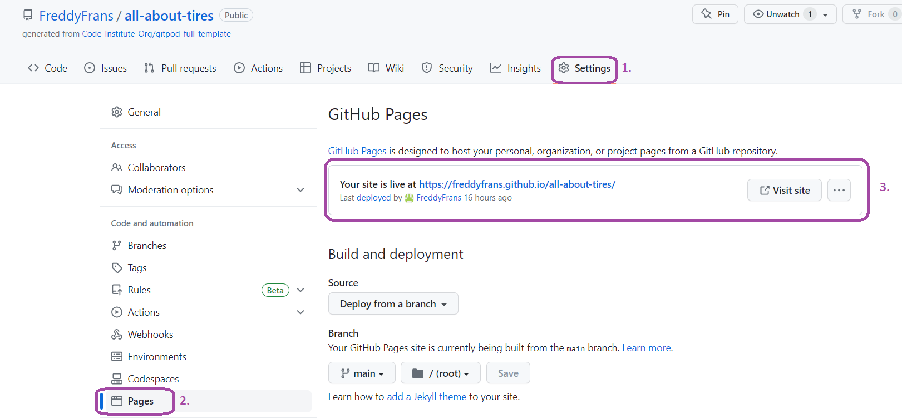

## Goal with the site

The goal of this website is to give people a perspective on how long tires have been around, and how important it is to take care of them. Safety starts with the grip on the asphalt.
The site is aimed at anyone who drives a vehicle on the road, everything from motorcycles to trucks and from slow-moving vehicles to racing vehicles.
 ## [All About Tires](https://freddyfrans.github.io/all-about-tires/)

## Navigation
- [Design choices](#design-choices)
- [Existing features](#existing-features)
- [The landing page](#the-landing-page)
- [History of the car tire](#history-of-the-car-tire)
- [Tire compound](#tire-compound)
- [The footer](#the-footer)
- [Services](#services)
- [Contact page](#contact-page)
- [Features left to implement](#features-left-to-implement)
- [Testing](#testing)
- [Validator](#validator)
- [Unfixed bugs](#unfixed-bugs)
- [Technologies Used](#technologies-used)
- [Deployment](#deployment)
- [Credits](#credits)
## Design choices
- ### Typography
  - The fonts I chosen are orbitron for headings and ubuntu for body text. I chose the design of the fonts to give the website a slightly more futuristic and easy to read look.
- ### Colour Scheme
  - I chose white, dark gray and red as the color combination. This is to get good contrasts and a little mystery throughout the website.

## Existing features
- Featured on all three pages are home, services and contact, where the navigation is identical for easy use and navigation.

## The landing page
- The landing page features a sporty car in the city to make the reader more convinced and drawn towards performance.

## History of the car tire
- A short history of how the tire came about and developed over the years.

## Tire compound
- Here is a simple explanation of how the construction of the tire affects wear and grip.

## The footer
- Here is three social media links and one google map link to the shop, for easy access to the location.

- The four links follow the footer through all three pages to make a pleasant experience for the user.

## Services

- The image should give the reader the impression that the mechanics have a passion for vehicles and are very thorough in their processes to make the car as safe as possible.

- This section provides the reader with information about what services the company provides as well as costs for renting the services.

## Contact page

- On the contact page there is a form where you fill in your name, email address and a box where you explain what you need help with and then press submit.

- Below the contact form is a video. When you press play, you get to see two mechanics changing a tire on a fast car.

## Features left to implement

- The tire workshop also wants automatic booking on the website, where the customer gets a email where it says time and date for the tire change.

## Testing

- I have had six people test the functions on the website where all of them uses different types of cellphones, all of them gave the site good feedback. No bugs were found when the people carried out the tests.

- The site looks good through all screensizes.

## Validator

- ### HTML 
  - W3C validator gave no warning or errors.
  [W3C validator](https://validator.w3.org/nu/?doc=https%3A%2F%2Ffreddyfrans.github.io%2Fall-about-tires%2F)
  
- ### CSS 
  - jigsaw validator gave no errors and one warning.
  [Jigsaw validator](assets/images/jigsaw-validator.png)
  
- ### Lighthouse

## Unfixed bugs
- #### Jigsaw validator warning
  - Imported templates are not reviewed when entering directly or when uploading files.
  (The warning is not going to be fixed due to the font family i want for the homepage.)
## Technologies Used
- HTML 5
- CSS
- Gitpod
- Github
- Codeanywhere
## Deployment
- The site was deployed to GitHub pages. The steps to deploy are as follows:
  1. In the GitHub repository, navigate to the Settings tab.
  2. Once in Settings, navigate to the Pages tab on the left hand side.
  
  3. Under Source, select the branch to master, then click save.
  
  4. Once the master branch has been selected, the page will be automatically refreshed with a detailed ribbon display to indicate the successful deployment.

 ## Credits
 - ### content
   - The text about the history of the car tire comes from Morgan Pritchett at thenewswheel.com
   - Tire compounds text comes from Joey Deriquito at autodeal.com
   - The icons in the footer were taken from fontawesome.com and cdnjs.com
   - Form credit to Zach Saucier on codepen.io
   - README content credit to Ewan Colquhoun at github
- ### Media
  - Hero image was taken from Pexels [Hero Image.](https://pixabay.com/sv/photos/porsche-bil-bromsljus-bakljus-1851246/)
  
  - Service image and contact video from Cottonbro studio at Pexels. [Image](https://www.pexels.com/sv-se/foto/bil-fordon-neon-fixa-4488665/) [Video](https://www.pexels.com/video/car-vehicle-fix-repair-4489885/)
 
- ### General problem solving credits
    - www.30secondsofcode.org
    - www.w3schools.com
    - www.codeinstitute.net 
    - www.stackoverflow.com
- ### Acknowledgements
The site was completed as a Portfolio 1 Project  for the Full Stack Software Developer (e-Commerce) Diploma at the Code Institute.
I would like to thank my mentor Precious Ijege for the support on this project.
All About Tires exists and is a company who my friend started, but with a different name. 